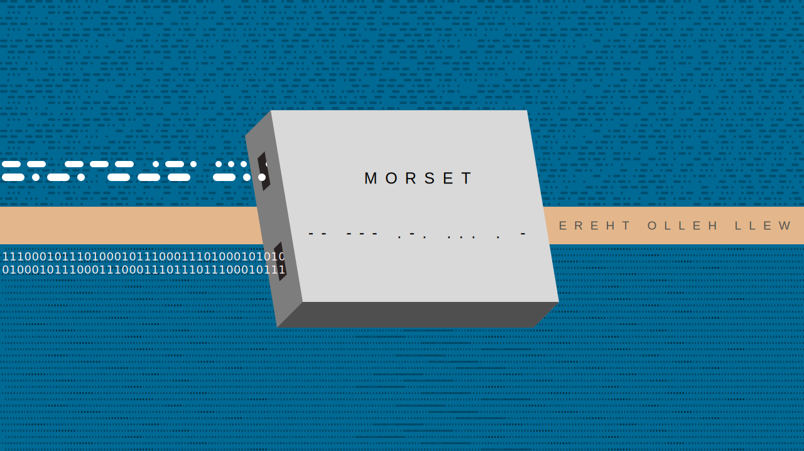

Morse Code Translator

## Table of Content
- [Quick Introduction](#quick-introduction)
- [Installing](#installing)
- [Usage](#usage)
    - [Examples](#examples)
        - [Launch into live-translating mode (line after line).](#launch-into-live-translating-mode-(line-after-line).)
        - [Pipe as input](#pipe-as-input)
        - [File(s) as input](#file(s)-as-input)
        - [Print the alphabet in morse code](#print-the-alphabet-in-morse-code)
    - [Flags](#flags)
- [Uninstalling](#uninstalling)

## Quick Introduction

I learned Morse Code in a day and I thought it would be nice to have a tool to translate it in both ways - even if only for flexing purposes...

It can read from **stdin**, **pipe** or **file** - analogy to the **cat** command. Usage is simple and intuitive.

## Installing

Download repo to your **$HOME** directory using

```bash
git clone https://github.com/Adamocho/morset.git ~/morset
```

> NOTE: If you want a shallow clone (uses less disk space), add a `--depth 1` flag between **git clone** and **URL**.

Next, **cd** inside and compile the programme.

```bash
# Provided you are in your $HOME directory
cd morset

# Then
cargo build -r # OR --release
```

Now, create a symlink to the binary or move/copy it to your **~/.local/bin** folder.

```bash
# Create symlink
ln -s $PWD/target/release/morset ~/.local/bin/morset

# OR copy the binary
cp -a target/release/morset ~/.local/bin/morset

# OR move it there
mv target/release/morset ~/.local/bin/morset
```

> NOTE: If the binary does not execute, add the **execute** permission with `chmod +x filename`

After that, make sure that the ~/.local/bin (or the one specified) directory is in $PATH.

```bash
echo $PATH
# And look at the output

# Use ripgrep (or grep) if you are lazy ;)
echo $PATH | rg local # OR grep local
```

If it is - **great**! 

If it's not - add it to your **shell config file**.

```bash
# In some config file like '.profile' or '.zshrc', etc.
export PATH="$HOME/.local/bin:$PATH"
```

## Usage


### Examples

#### Launch into live-translating mode (line after line).

> Terminate with Ctrl-C or Ctrl-D
```bash
morset

# Sample input
hello   # And ENTER
# Sample output
.... . .-.. .-.. ---
```

#### Pipe as input

```bash
echo $PATH | morset
```

#### File(s) as input

```bash
morset file1 file2 [...]
```

#### Print the alphabet in morse code

> NOTE: This is a **command**. For more commands see **--help**.
```bash
morset alphabet

# Output
'a'     .-
'b'     -...
'c'     -.-.
'd'     -..
[...]
```

### Flags

#### `-o` or `--output`

Specify the output file.

#### `-b` or `--binary`

Use binary system - zeros `0` and ones `1` - instead of dots `.` and dashes `-`.

#### `-d` or `--decode`

Decode the text instead of encoding it. Works with the `-b` flag.

#### `-h` or `--help`

Show help menu.

## Uninstalling

Just delete the directory altogether.

A simple, fast and reliable method.
